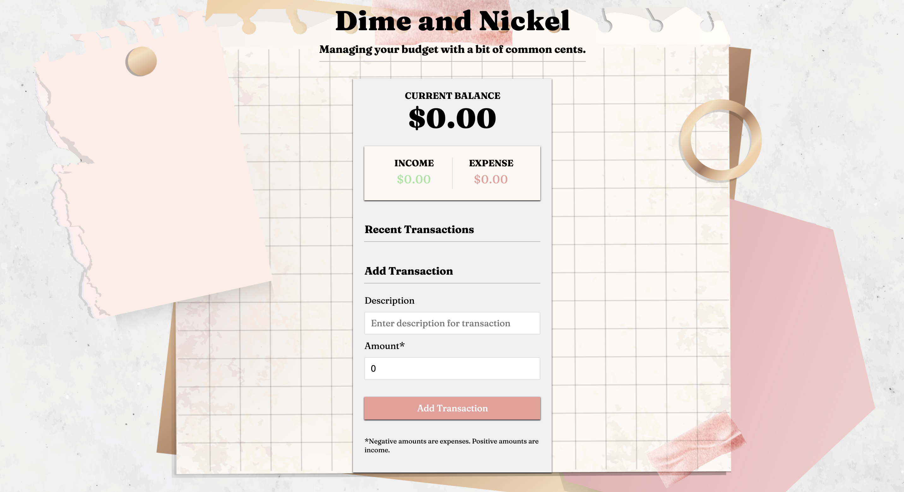

# Dime and Nickel

[](https://opensource.org/licenses/MIT)

## Table of Contents

- [Description](#description)
- [User Story](#user-story)
- [Features of the Application](#features-of-the-application)
- [Preview of Dime and Nickel](#preview-of-dime-and-nickel)
- [Links](#links)
- [Built Using](#built-using)
- [License](#license)
- [Contributing](#contributing)
- [Questions](#questions)

## Description

Dime and Nickel is a mobile-responsive, budget tracking application. (It is the MERN-stack version of [Dime and Penny](https://github.com/rh9891/DimeAndPenny). The application takes the original dynamically updated vanilla javascript project and updates it to a React application while adding a backend API with Express and MongoDB.)

## User Story

```
AS A user
I WANT to track items I purchase (and their cost) and calculate the amount of money spent over time
SO THAT I can manage my daily spending efficiently.
```

## Features of the Application

```
GIVEN an expense-tracking application
WHEN I want to add an income
THEN I insert a positive amount with a description of the transaction and add the transaction.

WHEN I want to track an expense
THEN I insert a negative amount with a description of the transaction and add the transaction.

WHEN I add an expense
THEN the transaction is displayed under "Recent Transactions" and marked in red.

WHEN I add an income
THEN the transaction is displayed under "Recent Transactions" and marked in green.

WHEN I hover over a listed transaction
THEN an X will be displayed that can be clicked to delete the transaction.
```

## Preview of Dime and Nickel



## Links

- [Deployed Application](https://dime-and-nickel.herokuapp.com)

- [Github Repository](https://github.com/rh9891/DimeAndNickel)

## Built Using

Listed below are the frameworks, libraries, and guides that made building this application possible:

- [Axios](https://www.npmjs.com/package/axios)
- [Colors](https://www.npmjs.com/package/colors)
- [Context API](https://reactjs.org/docs/context.html)
- [Express](https://expressjs.com/)
- [MongoDB](https://www.mongodb.com/what-is-mongodb)
- [Mongoose](https://mongoosejs.com/)
- [Morgan](https://www.npmjs.com/package/morgan)
- [React Hooks](https://reactjs.org/docs/hooks-intro.html)
- [React.js](https://reactjs.org/docs/getting-started.html)
- [Traversy Media Tutorials](https://www.traversymedia.com)

## License

The MIT License (MIT)

Copyright (c) 2021 Romie Hecdivert

Permission is hereby granted, free of charge, to any person obtaining a copy of this software and associated documentation files (the "Software"), to deal in the Software without restriction, including without limitation the rights to use, copy, modify, merge, publish, distribute, sublicense, and/or sell copies of the Software, and to permit persons to whom the Software is furnished to do so, subject to the following conditions:

The above copyright notice and this permission notice shall be included in all copies or substantial portions of the Software.

THE SOFTWARE IS PROVIDED "AS IS", WITHOUT WARRANTY OF ANY KIND, EXPRESS OR IMPLIED, INCLUDING BUT NOT LIMITED TO THE WARRANTIES OF MERCHANTABILITY, FITNESS FOR A PARTICULAR PURPOSE AND NONINFRINGEMENT. IN NO EVENT SHALL THE AUTHORS OR COPYRIGHT HOLDERS BE LIABLE FOR ANY CLAIM, DAMAGES OR OTHER LIABILITY, WHETHER IN AN ACTION OF CONTRACT, TORT OR OTHERWISE, ARISING FROM, OUT OF OR IN CONNECTION WITH THE SOFTWARE OR THE USE OR OTHER DEALINGS IN THE SOFTWARE.

## Contributing

If you would like to contribute to this repository, please contact me via [Github](https://github.com/rh9891).

## Questions

If you have any questions, comments, or issues regarding this application, please do not hesitate to contact me via [Github](https://github.com/rh9891).
